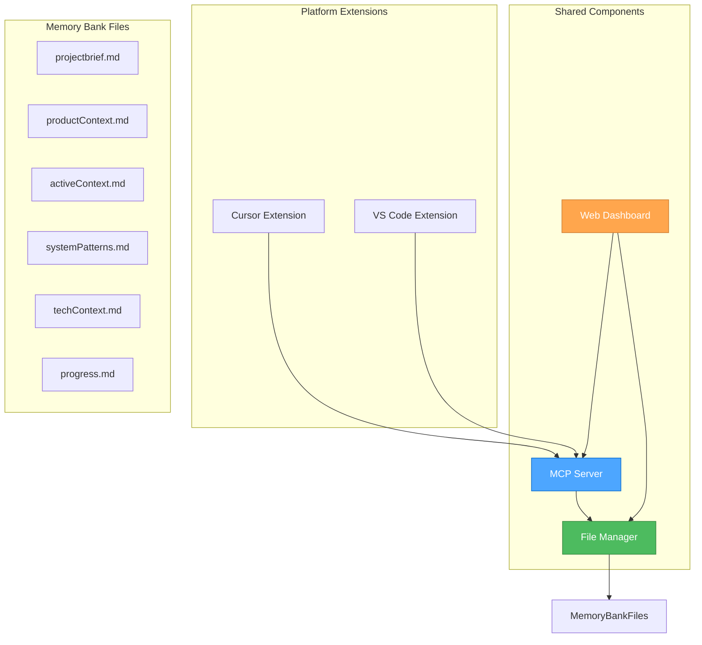

# Cross-Platform Memory Bank System - Complete Session Analysis & PRD

## Session Overview

This document contains the complete analysis and comprehensive PRD (Product Requirements Document) for creating a cross-platform memory bank system based on the aimemory project. The session included detailed examination of both aimemory and cursor-memory-bank projects, followed by recommendations and a complete implementation plan.

---

## Part 1: Initial Analysis

### User Query
"I want you to review the open source code for this aimemory against the other open source code at /Users/robert.lee/GithubProjects/cursor-memory-bank. My goal is to find a solution to save session context for you to access, update and modify as you progress with the project. Can the aimemory or the cursor-memory-bank open source code be used with Cursor? Can it be modified to also be used with VS Code? I believe that the aimemory has an MCP server extension. Does this work with VS Code?"

### Analysis Summary

#### **aimemory Project**
- **Type**: VS Code/Cursor extension with MCP server
- **Architecture**: Uses Model Context Protocol (MCP) to provide memory bank functionality
- **Core Features**: 
  - MCP server that exposes memory bank files as resources
  - VS Code extension that manages the MCP server
  - Web-based dashboard for viewing memory bank files
  - Automatic Cursor MCP configuration updates

#### **cursor-memory-bank Project**
- **Type**: Custom modes system for Cursor
- **Architecture**: Uses Cursor's custom modes feature with hierarchical rule loading
- **Core Features**:
  - Six specialized modes (VAN, PLAN, CREATIVE, IMPLEMENT, REFLECT, ARCHIVE)
  - Token-optimized rule loading system
  - Visual process maps for each mode
  - Complexity-based workflow adaptation

### Key Findings

#### **aimemory Architecture**
```typescript
// Core components
- MemoryBankMCPServer: MCP server implementation
- MemoryBankService: File management
- WebviewManager: Dashboard interface
- CommandHandler: /memory command processing
```

#### **cursor-memory-bank Architecture**
```typescript
// Core components
- Custom modes with specialized instructions
- Hierarchical rule loading system
- Visual process maps
- Token-optimized workflows
```

### Comparison Table

| Aspect | aimemory (MCP) | cursor-memory-bank (Custom Modes) |
|--------|----------------|-----------------------------------|
| **Platform Support** | Cursor-specific | Cursor-specific |
| **Architecture** | MCP server + extension | Custom modes + rules |
| **Memory Management** | File-based with MCP resources | File-based with rule loading |
| **Token Efficiency** | Moderate | High (optimized rule loading) |
| **VS Code Compatibility** | Requires major refactoring | Not applicable |
| **Complexity** | Medium | High (sophisticated mode system) |

---

## Part 2: Answers to User Questions

### 1. **Can aimemory be used with Cursor?**
**Yes, but with limitations.** The aimemory project is specifically designed for Cursor and includes:
- Automatic Cursor MCP configuration updates
- Cursor-specific command interception (`cursor.newChat`)
- Integration with Cursor's MCP support

However, it's **not designed for VS Code** - it uses Cursor-specific APIs and configurations.

### 2. **Can it be modified for VS Code?**
**Yes, but requires significant modifications:**

**Current Cursor-specific dependencies:**
```typescript
// Cursor-specific command registration
vscode.commands.registerTextEditorCommand("cursor.newChat", ...)
vscode.commands.executeCommand("_cursor.newChat", text)

// Cursor-specific MCP config updates
updateCursorMCPConfig(port) // Updates ~/.cursor/mcp.json
```

**Required changes for VS Code compatibility:**
1. **Remove Cursor-specific commands** - VS Code doesn't have `cursor.newChat`
2. **Replace MCP integration** - VS Code doesn't have built-in MCP support
3. **Alternative communication** - Use VS Code's extension API for AI integration
4. **Configuration management** - Replace Cursor's MCP config with VS Code settings

### 3. **Does the MCP server work with VS Code?**
**No, not directly.** The MCP server is designed for Cursor's MCP integration. VS Code doesn't have built-in MCP support, so you'd need to:

1. **Create a VS Code extension** that communicates with the MCP server
2. **Use VS Code's extension API** to integrate with AI assistants
3. **Implement alternative communication** between VS Code and the memory bank

---

## Part 3: Recommendations

### **For Cursor Users:**
1. **Use cursor-memory-bank** if you want a sophisticated, token-optimized system with specialized modes
2. **Use aimemory** if you prefer a simpler MCP-based approach with web dashboard

### **For VS Code Users:**
1. **Modify aimemory** by removing Cursor-specific dependencies and implementing VS Code extension patterns
2. **Create a new VS Code extension** that implements memory bank functionality using VS Code's extension API
3. **Use VS Code's built-in AI features** with a custom extension for memory management

### **For Cross-Platform Solution:**
Consider creating a **unified memory bank system** that:
- Uses a common file format for memory bank files
- Provides platform-specific extensions (VS Code, Cursor, etc.)
- Implements a shared MCP server that can be used by any platform with MCP support

The aimemory project provides a good foundation for this approach, but would need significant refactoring to remove Cursor-specific dependencies and make it truly cross-platform.

---

## Part 4: User Follow-up Question

### User Query
"I want to go with the simple aimemory. I do not want to use it if it requires an api key. Can you confirm that aimemory is really free, no API keys required and no trial or limited time offer."

### Analysis Results

#### **✅ No API Keys Required**
- **No external API dependencies** - The extension only uses local dependencies
- **No authentication required** - No login, registration, or API key setup needed
- **No cloud services** - Everything runs locally on your machine
- **No external API calls** - The MCP server operates entirely locally

#### **✅ Completely Free**
- **Apache 2.0 License** - Open source and free to use, modify, and distribute
- **No subscription fees** - No recurring payments or premium tiers
- **No trial limitations** - Full functionality available immediately
- **No usage limits** - No restrictions on how much you can use it

#### **✅ No Hidden Costs**
- **No external dependencies** - Only uses standard Node.js packages
- **No proprietary services** - Everything is open source
- **No data collection** - All data stays on your local machine
- **No telemetry** - No tracking or analytics

#### **✅ Dependencies (All Free)**
```json
{
  "@modelcontextprotocol/sdk": "^1.6.1",  // Open source MCP library
  "cors": "^2.8.5",                       // Standard web library
  "express": "^4.18.3",                   // Standard web server
  "zod": "^3.22.4"                        // Open source validation
}
```

**Bottom Line**: aimemory is a completely free, open-source extension that runs entirely on your local machine with no external dependencies, API keys, or hidden costs. You can use it immediately without any setup beyond installing the extension.

---

## Part 5: Comprehensive PRD for Cross-Platform Memory Bank System

# Comprehensive PRD: Cross-Platform Memory Bank System

## Executive Summary

This document outlines a comprehensive plan to create a unified, cross-platform memory bank system that can work with both Cursor and VS Code, while maintaining the simplicity and effectiveness of the original aimemory approach. The system will provide session context management through a shared MCP server architecture with platform-specific extensions.

## 1. Project Overview

### 1.1 Problem Statement
- Current memory bank solutions are platform-specific (Cursor-only or VS Code-only)
- No unified solution for cross-platform session context management
- Lack of standardized approach for AI context persistence across different IDEs
- Need for a solution that works without API keys or external dependencies

### 1.2 Solution Overview
A unified memory bank system consisting of:
- **Shared MCP Server**: Platform-agnostic memory bank server
- **Platform Extensions**: VS Code and Cursor-specific extensions
- **Common File Format**: Standardized memory bank file structure
- **Web Dashboard**: Cross-platform management interface

### 1.3 Success Metrics
- ✅ Works seamlessly on both Cursor and VS Code
- ✅ No API keys or external dependencies required
- ✅ Maintains session context across IDE sessions
- ✅ Provides intuitive web dashboard for management
- ✅ Open source with Apache 2.0 license

## 2. Technical Architecture

### 2.1 System Architecture Diagram



### 2.2 Component Breakdown

#### 2.2.1 Shared MCP Server
- **Purpose**: Platform-agnostic memory bank management
- **Technology**: Node.js with Express and MCP SDK
- **Features**: 
  - Memory bank file CRUD operations
  - Resource exposure for AI models
  - Tool definitions for AI interactions
  - WebSocket/SSE communication

#### 2.2.2 Platform Extensions
- **Cursor Extension**: Leverages Cursor's MCP support
- **VS Code Extension**: Implements VS Code extension API patterns
- **Common Features**:
  - Server lifecycle management
  - Platform-specific UI integration
  - Configuration management

#### 2.2.3 Web Dashboard
- **Purpose**: Cross-platform memory bank management
- **Technology**: React with TypeScript
- **Features**:
  - File viewing and editing
  - Real-time updates
  - Search and navigation
  - Export/import functionality

## 3. Detailed Implementation Plan

### 3.1 Phase 1: Core MCP Server Refactoring

#### 3.1.1 Extract Platform-Agnostic Components
```typescript
// src/shared/types.ts
export interface MemoryBankFile {
  type: MemoryBankFileType;
  content: string;
  lastUpdated?: Date;
}

export interface MemoryBankService {
  initialize(): Promise<void>;
  getFile(type: MemoryBankFileType): MemoryBankFile | undefined;
  updateFile(type: MemoryBankFileType, content: string): Promise<void>;
  getAllFiles(): MemoryBankFile[];
}

// src/shared/mcp-server.ts
export class PlatformAgnosticMCPServer {
  private server: McpServer;
  private memoryBank: MemoryBankService;
  
  constructor(memoryBank: MemoryBankService) {
    this.memoryBank = memoryBank;
    this.server = new McpServer({
      name: "Cross-Platform Memory Bank",
      version: "1.0.0"
    });
  }
  
  // Platform-agnostic MCP implementation
}
```

#### 3.1.2 Create Platform Abstraction Layer
```typescript
// src/shared/platform-interface.ts
export interface PlatformInterface {
  showInformationMessage(message: string): void;
  showErrorMessage(message: string): void;
  getWorkspaceRoot(): string | undefined;
  registerCommand(command: string, callback: Function): void;
  createWebviewPanel(title: string, content: string): void;
}

// src/cursor/platform-adapter.ts
export class CursorPlatformAdapter implements PlatformInterface {
  constructor(private context: vscode.ExtensionContext) {}
  
  showInformationMessage(message: string): void {
    vscode.window.showInformationMessage(message);
  }
  
  // ... other implementations
}

// src/vscode/platform-adapter.ts
export class VSCodePlatformAdapter implements PlatformInterface {
  constructor(private context: vscode.ExtensionContext) {}
  
  showInformationMessage(message: string): void {
    vscode.window.showInformationMessage(message);
  }
  
  // ... other implementations
}
```

### 3.2 Phase 2: Platform-Specific Extensions

#### 3.2.1 Cursor Extension
```typescript
// src/cursor/extension.ts
export function activate(context: vscode.ExtensionContext) {
  const platformAdapter = new CursorPlatformAdapter(context);
  const memoryBank = new MemoryBankService(platformAdapter);
  const mcpServer = new PlatformAgnosticMCPServer(memoryBank);
  
  // Cursor-specific MCP integration
  const cursorIntegration = new CursorMCPIntegration(mcpServer);
  cursorIntegration.setup();
  
  // Register commands
  registerCommands(context, platformAdapter, mcpServer);
}

class CursorMCPIntegration {
  constructor(private mcpServer: PlatformAgnosticMCPServer) {}
  
  setup(): void {
    // Leverage Cursor's built-in MCP support
    this.updateCursorMCPConfig();
  }
  
  private updateCursorMCPConfig(): void {
    // Update ~/.cursor/mcp.json
  }
}
```

#### 3.2.2 VS Code Extension
```typescript
// src/vscode/extension.ts
export function activate(context: vscode.ExtensionContext) {
  const platformAdapter = new VSCodePlatformAdapter(context);
  const memoryBank = new MemoryBankService(platformAdapter);
  const mcpServer = new PlatformAgnosticMCPServer(memoryBank);
  
  // VS Code-specific AI integration
  const aiIntegration = new VSCodeAIIntegration(mcpServer);
  aiIntegration.setup();
  
  // Register commands
  registerCommands(context, platformAdapter, mcpServer);
}

class VSCodeAIIntegration {
  constructor(private mcpServer: PlatformAgnosticMCPServer) {}
  
  setup(): void {
    // Integrate with VS Code's AI features
    this.registerAIChatProvider();
  }
  
  private registerAIChatProvider(): void {
    // Register custom AI chat provider
  }
}
```

### 3.3 Phase 3: Web Dashboard Enhancement

#### 3.3.1 Enhanced Dashboard Features
```typescript
// src/webview/components/MemoryBankDashboard.tsx
interface MemoryBankDashboardProps {
  mcpServer: PlatformAgnosticMCPServer;
}

export const MemoryBankDashboard: React.FC<MemoryBankDashboardProps> = ({ mcpServer }) => {
  const [files, setFiles] = useState<MemoryBankFile[]>([]);
  const [selectedFile, setSelectedFile] = useState<MemoryBankFile | null>(null);
  
  useEffect(() => {
    loadFiles();
  }, []);
  
  const loadFiles = async () => {
    const allFiles = await mcpServer.getAllFiles();
    setFiles(allFiles);
  };
  
  return (
    <div className="memory-bank-dashboard">
      <FileList files={files} onFileSelect={setSelectedFile} />
      <FileEditor file={selectedFile} onSave={handleSave} />
      <MemoryBankStatus mcpServer={mcpServer} />
    </div>
  );
};
```

#### 3.3.2 Real-time Updates
```typescript
// src/webview/hooks/useMemoryBankUpdates.ts
export const useMemoryBankUpdates = (mcpServer: PlatformAgnosticMCPServer) => {
  const [files, setFiles] = useState<MemoryBankFile[]>([]);
  
  useEffect(() => {
    const eventSource = new EventSource('/memory-bank-updates');
    
    eventSource.onmessage = (event) => {
      const update = JSON.parse(event.data);
      setFiles(prev => updateFiles(prev, update));
    };
    
    return () => eventSource.close();
  }, [mcpServer]);
  
  return files;
};
```

### 3.4 Phase 4: Advanced Features

#### 3.4.1 Memory Bank Templates
```typescript
// src/shared/templates/index.ts
export interface MemoryBankTemplate {
  name: string;
  description: string;
  files: Record<MemoryBankFileType, string>;
}

export const TEMPLATES: MemoryBankTemplate[] = [
  {
    name: "Web Application",
    description: "Template for web application development",
    files: {
      [MemoryBankFileType.ProjectBrief]: "# Web Application Project\n\n## Overview\n...",
      [MemoryBankFileType.ProductContext]: "# Product Context\n\n## User Stories\n...",
      // ... other files
    }
  },
  {
    name: "API Development",
    description: "Template for API development projects",
    files: {
      // ... template files
    }
  }
];
```

#### 3.4.2 Export/Import Functionality
```typescript
// src/shared/export-import.ts
export class MemoryBankExportImport {
  static async exportToJSON(memoryBank: MemoryBankService): Promise<string> {
    const files = memoryBank.getAllFiles();
    const exportData = {
      version: "1.0.0",
      timestamp: new Date().toISOString(),
      files: files.map(file => ({
        type: file.type,
        content: file.content,
        lastUpdated: file.lastUpdated
      }))
    };
    
    return JSON.stringify(exportData, null, 2);
  }
  
  static async importFromJSON(jsonData: string, memoryBank: MemoryBankService): Promise<void> {
    const importData = JSON.parse(jsonData);
    
    for (const fileData of importData.files) {
      await memoryBank.updateFile(fileData.type, fileData.content);
    }
  }
}
```

## 4. File Structure

```
cross-platform-memory-bank/
├── src/
│   ├── shared/
│   │   ├── types.ts
│   │   ├── mcp-server.ts
│   │   ├── memory-bank-service.ts
│   │   ├── platform-interface.ts
│   │   ├── templates/
│   │   └── export-import.ts
│   ├── cursor/
│   │   ├── extension.ts
│   │   ├── platform-adapter.ts
│   │   └── mcp-integration.ts
│   ├── vscode/
│   │   ├── extension.ts
│   │   ├── platform-adapter.ts
│   │   └── ai-integration.ts
│   └── webview/
│       ├── components/
│       ├── hooks/
│       └── utils/
├── package.json
├── tsconfig.json
└── README.md
```

## 5. Implementation Timeline

### Week 1-2: Core Infrastructure
- [ ] Extract platform-agnostic MCP server
- [ ] Create platform abstraction layer
- [ ] Implement shared memory bank service
- [ ] Set up basic project structure

### Week 3-4: Cursor Extension
- [ ] Implement Cursor platform adapter
- [ ] Integrate with Cursor's MCP support
- [ ] Test Cursor-specific features
- [ ] Update documentation

### Week 5-6: VS Code Extension
- [ ] Implement VS Code platform adapter
- [ ] Create VS Code AI integration
- [ ] Test VS Code-specific features
- [ ] Handle VS Code extension API limitations

### Week 7-8: Web Dashboard
- [ ] Enhance web dashboard with real-time updates
- [ ] Add file editing capabilities
- [ ] Implement search and navigation
- [ ] Add export/import functionality

### Week 9-10: Advanced Features
- [ ] Implement memory bank templates
- [ ] Add version control integration
- [ ] Create comprehensive testing suite
- [ ] Performance optimization

### Week 11-12: Documentation & Release
- [ ] Complete documentation
- [ ] Create installation guides
- [ ] Package for distribution
- [ ] Release to extension marketplaces

## 6. Technical Requirements

### 6.1 Development Environment
- Node.js 18+
- TypeScript 5.0+
- pnpm package manager
- VS Code or Cursor for development

### 6.2 Dependencies
```json
{
  "dependencies": {
    "@modelcontextprotocol/sdk": "^1.6.1",
    "express": "^4.18.3",
    "cors": "^2.8.5",
    "zod": "^3.22.4",
    "react": "^18.0.0",
    "react-dom": "^18.0.0"
  },
  "devDependencies": {
    "@types/vscode": "^1.95.0",
    "@types/express": "^5.0.1",
    "@types/cors": "^2.8.17",
    "typescript": "^5.7.3",
    "esbuild": "^0.25.0"
  }
}
```

### 6.3 Platform Support
- **Cursor**: Full MCP integration
- **VS Code**: Extension API integration
- **Web**: Standalone dashboard
- **CLI**: Command-line interface (future)

## 7. Testing Strategy

### 7.1 Unit Testing
```typescript
// src/shared/__tests__/memory-bank-service.test.ts
describe('MemoryBankService', () => {
  it('should initialize memory bank files', async () => {
    const service = new MemoryBankService(mockPlatformAdapter);
    await service.initialize();
    
    expect(service.getAllFiles()).toHaveLength(6);
  });
  
  it('should update file content', async () => {
    const service = new MemoryBankService(mockPlatformAdapter);
    await service.updateFile(MemoryBankFileType.ProjectBrief, 'New content');
    
    const file = service.getFile(MemoryBankFileType.ProjectBrief);
    expect(file?.content).toBe('New content');
  });
});
```

### 7.2 Integration Testing
```typescript
// src/shared/__tests__/mcp-server.test.ts
describe('PlatformAgnosticMCPServer', () => {
  it('should expose memory bank files as resources', async () => {
    const server = new PlatformAgnosticMCPServer(mockMemoryBank);
    
    const resources = await server.listResources();
    expect(resources).toContain('memory-bank://projectbrief.md');
  });
});
```

### 7.3 Platform Testing
```typescript
// src/cursor/__tests__/extension.test.ts
describe('Cursor Extension', () => {
  it('should register commands', () => {
    const context = createMockExtensionContext();
    activate(context);
    
    expect(context.subscriptions).toHaveLength(5);
  });
});
```

## 8. Deployment Strategy

### 8.1 Extension Packaging
```json
// package.json
{
  "scripts": {
    "package:cursor": "pnpm run build && pnpm vsce package --target cursor",
    "package:vscode": "pnpm run build && pnpm vsce package --target vscode",
    "publish:cursor": "pnpm run package:cursor && pnpm vsce publish",
    "publish:vscode": "pnpm run package:vscode && pnpm vsce publish"
  }
}
```

### 8.2 Distribution Channels
- **Cursor Marketplace**: Direct integration
- **VS Code Marketplace**: Standard extension
- **Open VSX Registry**: Open source alternative
- **GitHub Releases**: Manual downloads

## 9. Documentation Plan

### 9.1 User Documentation
- Installation guides for each platform
- Quick start tutorials
- Troubleshooting guides
- Feature documentation

### 9.2 Developer Documentation
- Architecture overview
- API documentation
- Contributing guidelines
- Development setup

### 9.3 Technical Documentation
- MCP server specification
- File format specification
- Platform integration guides
- Testing documentation

## 10. Success Criteria

### 10.1 Functional Requirements
- [ ] Works seamlessly on both Cursor and VS Code
- [ ] No external dependencies or API keys
- [ ] Maintains session context across sessions
- [ ] Provides intuitive web dashboard
- [ ] Supports memory bank file management

### 10.2 Non-Functional Requirements
- [ ] Fast startup time (< 2 seconds)
- [ ] Low memory usage (< 50MB)
- [ ] Reliable file operations
- [ ] Cross-platform compatibility
- [ ] Open source license

### 10.3 Quality Requirements
- [ ] Comprehensive test coverage (> 80%)
- [ ] TypeScript strict mode compliance
- [ ] ESLint compliance
- [ ] Accessibility compliance
- [ ] Security best practices

## 11. Risk Mitigation

### 11.1 Technical Risks
- **MCP Protocol Changes**: Version pinning and compatibility layers
- **Platform API Changes**: Abstraction layer and version detection
- **Performance Issues**: Profiling and optimization strategies

### 11.2 Business Risks
- **Platform Lock-in**: Open source and multiple distribution channels
- **User Adoption**: Comprehensive documentation and tutorials
- **Maintenance Burden**: Automated testing and CI/CD

## 12. Future Enhancements

### 12.1 Planned Features
- CLI interface for command-line users
- Mobile app for remote management
- Cloud sync (optional, user-controlled)
- Advanced AI integration features

### 12.2 Platform Expansion
- JetBrains IDEs support
- Sublime Text support
- Vim/Neovim support
- Browser-based editor support

---

## Conclusion

This comprehensive plan provides a detailed roadmap for implementing a cross-platform memory bank system that maintains the simplicity of the original aimemory while expanding its reach to multiple platforms. The modular architecture ensures maintainability and extensibility for future enhancements.

The system will provide a unified solution for session context management across different IDEs, with no external dependencies or API keys required, making it accessible to all developers regardless of their preferred development environment. 